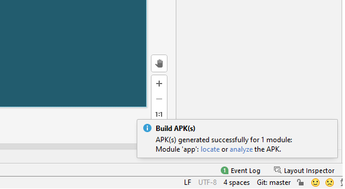

### Sự kiện và xử lý sự kiện touch (chạm) và multi-touch (đa chạm) trong Android

- <a href= "https://ngocminhtran.com/2018/10/06/su-kien-va-xu-ly-su-kien-touch-cham-va-multi-touch-da-cham-trong-android/"> Ứng Dụng Từ Bài</a>

### Yêu Cầu
A. MÔ TẢ VỀ Android Studio:

- Sự kiện và xử lý sự kiện Touch
- Giống như các sự kiện khác, sự kiện Touch của một view có thể được phát hiện và xử lý thông qua việc đăng ký với trình lắng nghe sự kiện onTouchListener và thực thi phương thức onTouch() tương ứng. Ví dụ xử lý sự kiện Touch cho view – là một ConstraintLayout có thể hiện là myLayout:

- Đối tượng MotionEvent
- Để nhận thông tin từ sự kiện Touch, đối tượng MotionEvent phải được chuyển đến phương thức onTouch(). Thông tin có thể là vị trí xảy ra sự kiện Touch thông qua các phương thức getX(), getY() của đối tượng MotionEvent hay kiểu hoạt động (type of action) xảy ra. Đối tượng MotionEvent cũng được dùng trong xử lý sự kiện đa chạm (multi-Touch).

- Các kiểu hoạt động của sự kiện Touch
- Thông tin về kiểu hoạt động kết hợp với một sự kiện Touch có thể xác định nhờ phương thức getActionMasked() của đối tượng MotionEvent. Một số kiểu hoạt động:

- ACTION_DOWN: xảy ra khi hoạt động chạm của người dùng xảy ra trên một view nào đó cùng với tọa độ của điểm được chạm.
- ACTION_UP: xảy ra khi người dùng rời khỏi màn hìn
- ACTION_MOVE: các hoạt động trung gian giữa ACTION_DOWN và ACTION_UP
- Trong trường hợp các sự kiện multi-Touch xảy ra, các hành động gồm các kiểu ACTION_POINTER_DOWN và ACTION_POINTER_UP tương ứng.

### Sau Khi Chúng ta thực hiện các bước trên :

- Chúng ta cũng có thể trải nghiệm trực tiếp trên thiết bị Android bằng cách cài tập tin apk trên thiết bị này. Tập tin apk của ứng dụng MotionEvent có thể tải tại đây hay có thể tạo trong Anddroid Studio 3.X (3.0 trở lên) như sau:
- Biên dịch ứng dụng MotionEvent thành tập tin apk bằng cách chọn Build > Build APK(s)

- Khi tạo tập tin apk thành công sẽ xuất hiện thông báo bên gốc phải dưới của Android Studio (từ cửa sổ Event log)
- Chọn liên kết locate để đến thư mục debug chứa tập tin apk

- Và Chạy.

### Chúc Các Bạn Thành Công !!!

### Bạn Có Thể Xem Bài Tiếp Theo:

- <a href="https://github.com/ChanhMinions/CommonGestures">Phát hiện cử chỉ người dùng với lớp Android Gesture Detector!</a>

                                                           Trần Phú , Ngày 23 tháng 7 Năm 2020

